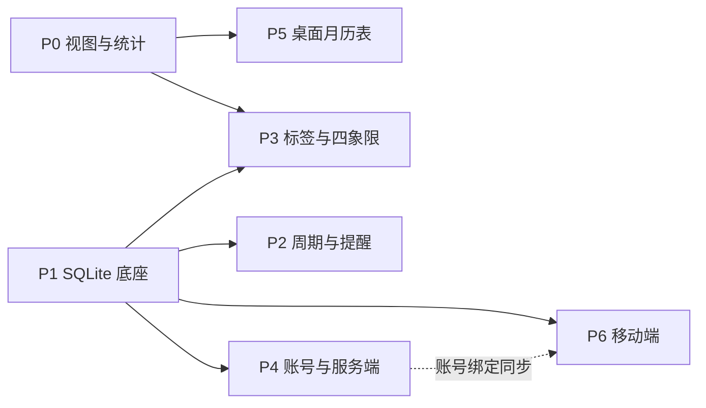

# 项目推进计划 · 总览

生成于 2026-07-22。需求源：README.md「产品定义/视图结构」；功能点与状态：TODO.md；工程规范：AGENTS.md；视觉基准：DESIGN.md。

维护规则：本目录记录**方案与拆解**，实现状态以 TODO.md 为准；每阶段完成后在对应阶段文件勾选任务、回写 TODO 状态。方案与现实冲突时先改计划文件再动代码。

## 已锁定决策（2026-07-22 用户确认）

| 决策点 | 结论 |
| --- | --- |
| 推进主线 | 底座先行：视图统计（不动数据层）→ SQLite → 功能扩展 → 账号/服务端 → 两端形态 |
| 端侧 SQLite 载体 | Rust 侧 rusqlite + command 封装，repository 在 Rust 层，前端经生成 bindings 调用 |
| 登录认证 | 邮箱 + 密码（自建，token 会话）；离线完整可用，登录仅解锁同步 |
| 服务端存储 | SQLite（rusqlite 复用，单文件自托管） |

## 阶段总览

| 阶段 | 名称 | 核心交付 | TODO 模块 | 前置 |
| --- | --- | --- | --- | --- |
| P0 | 视图与统计 | 主窗口双段导航、统计、月历视图、编辑入口 | 7、8、1.1 | 无 |
| P1 | SQLite 本地底座 | rusqlite 封装、repository、Store 迁移 | 6.1 | 无 |
| P2 | 周期任务与提醒升级 | 重复规则、实例生成、后台提醒调度 | 1.2、2 | P1 |
| P3 | 标签与四象限 | 契约扩展、标签管理/筛选、四象限视图 | 3、4 | P1（视图页承载依赖 P0） |
| P4 | 账号与服务端 | 邮箱登录、服务端 SQLite、同步随账号 | 5、6.2 | P1 |
| P5 | 桌面月历表 | 今日卡片演进为常驻月历表 | 8 | P0 |
| P6 | 移动端 | 构建、适配、三段导航、小组件、同步 | 9、2、6.2 | P1；账号绑定依赖 P4 |

## 依赖关系

P0 与 P1 无相互依赖，可并行或任选先后；P2/P3 在 P1 之后可并行；P5 可在 P0 后随时插入。

## 里程碑与完成判据

| 里程碑 | 内容 | 判据（对应产品闭环） |
| --- | --- | --- |
| M1 | P0 完成 | 「回顾」环打通：任意端内可看当日/周/月统计与月历分布 |
| M2 | P1 完成 | 数据底座就位：SQLite 全量替换 Store，旧数据无损迁移 |
| M3 | P2+P3 完成 | 「组织」环打通：周期任务自转、标签筛选、四象限可用 |
| M4 | P4 完成 | 多端数据归属：注册登录、服务端重启不丢数据、同步随账号 |
| M5 | P5 完成 | 桌面形态完备：月历表常驻桌面 |
| M6 | P6 完成 | 产品闭环：移动端全功能 + 主屏小组件 |

## 全局风险

1. **移动端小组件**：Tauri 2 不提供 widget 框架，iOS WidgetKit / Android AppWidget 需在生成的原生工程内用 Swift/Kotlin 编写，经共享 SQLite 读数据——P6 含专项调研任务，是全计划最大不确定项。
2. **新增依赖**：rusqlite、argon2（密码哈希）等需进 workspace；AGENTS.md「勿新增 thiserror/anyhow」不受影响，但每个新依赖在阶段文件中列明理由。
3. **契约演进**：recurrence/tags/quadrant 字段分散在 P2/P3 落地，每次都要重跑 `pnpm run types:generate` 并同步全部调用方（AGENTS 端侧总则）；无版本号机制下按「可选字段 + serde default」保持前后兼容。
4. **前端无测试框架**：验证依赖 `pnpm run check` + 手动走查（AGENTS 验证标准）；P1 起 Rust 侧逻辑尽量下沉到可 `cargo test` 的层（domain/storage/service），压缩纯手测面。
