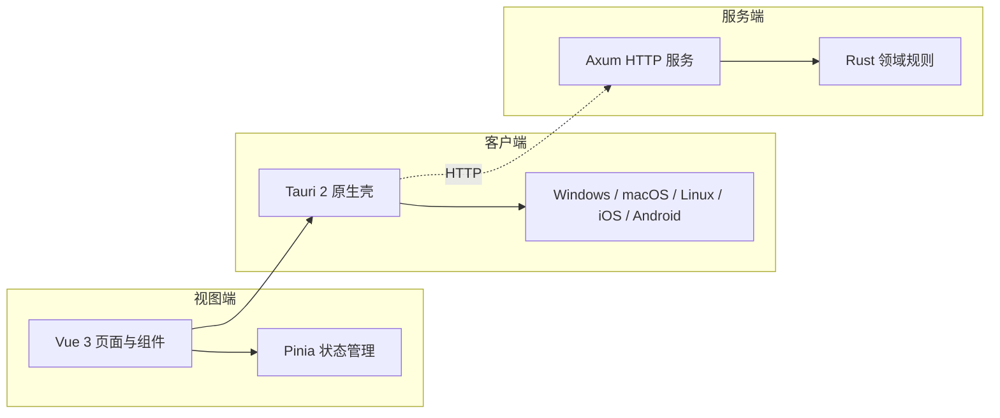

# 跨端待办应用

## 应用介绍

这是一个面向 Windows、macOS、Linux、iOS 和 Android 的跨端待办应用。用户可在不同设备上创建、查看、组织和完成待办任务，获得一致、清晰的任务管理体验。

当前版本聚焦基础待办管理；持久化、同步、账号和提醒暂不在本阶段范围内。

## 架构图

## 平台能力

### 能力状态总览

- [x] 基础待办管理（创建 / 完成 / 删除）
- [x] 主题：浅色 / 深色 / 跟随系统，启动恢复偏好，系统主题变化同步
- [x] 持久化：桌面端走官方 Store，浏览器开发模式回退 localStorage
- [x] 诊断日志：前端统一入口，桌面端转发到官方 Log 插件
- [x] 系统托盘（桌面）：菜单含显示/隐藏、今日数量、退出；双击切换主界面
- [x] 关闭隐藏到托盘：可在设置内关闭
- [x] 截止日与提醒：`dueDate`（本地日期）/ `reminderAt`（带时区时刻）
- [x] 提醒通知：到点系统通知；首次静默请求权限，被拒绝优雅降级
- [x] 全局快捷键：`CommandOrControl+Shift+A` 唤起主界面并聚焦输入框（含从托盘唤醒）
- [x] 桌面卡片（今日待办窗口）：独立轻量窗口，按主显示器 DPI / 工作区右下角定位，始终置顶；与主窗口通过 Tauri event 双向同步
- [ ] 单实例：依赖 `tauri-plugin-single-instance`，离线缓存缺失，联网或纯 Rust 自实现后推进
- [x] 跨设备同步：客户端通过 HTTP 与 Axum 服务端操作式同步（op-based），本地变更记录为操作推送，远端变更按修订顺序字段级合并（服务端优先）
- [ ] 应用关闭期间的提醒：当前基于前端 `setTimeout`（应用运行期有效），后续叠加 Rust `NotificationBuilder::schedule` 后台调度

### 平台能力矩阵

| 能力                       | iOS / Android    | Windows / macOS / Linux | 说明                                         |
| -------------------------- | ---------------- | ----------------------- | -------------------------------------------- |
| 基础待办管理               | ✅               | ✅                      | 创建 / 完成 / 删除                           |
| 主题（浅 / 深 / 跟随系统） | ✅               | ✅                      | 启动恢复；系统主题变化同步                   |
| 持久化                     | ✅（浏览器回退） | ✅                      | 官方 Store；浏览器回退 localStorage          |
| 诊断日志                   | ✅（控制台）     | ✅                      | 桌面端转发官方 Log 插件                      |
| 系统托盘                   | —                | ✅                      | 菜单 + 双击切换                              |
| 关闭隐藏到托盘             | —                | ✅                      | 可在设置内关闭                               |
| 截止日                     | ✅               | ✅                      | 列表徽标（今天 / 明天 / 逾期）               |
| 提醒通知                   | —                | ✅                      | 桌面端系统通知；权限静默请求；应用运行期调度 |
| 全局快捷键                 | —                | ✅                      | `CommandOrControl+Shift+A`                   |
| 桌面卡片                   | —                | ✅                      | 独立轻量窗口；DPI 感知定位；event 双向同步   |
| 跨设备同步                 | —                | ✅                      | 操作式同步；服务端优先；字段级合并           |
| 单实例                     | —                | ⏳                      | 依赖未就绪                                   |

> 注：标记为 ✅ 的能力已完成静态验证（`pnpm run check` / `pnpm run build` / `cargo check`）。完整 Tauri 桌面运行时测试受本机 `STATUS_ENTRYPOINT_NOT_FOUND` 阻断，待修复 Windows 动态链接环境后复验运行时行为。各能力详细 QA 记录见 `.agents/docs/tasks/PLATFORM-FOUNDATION-00N/qa-report.md`。
