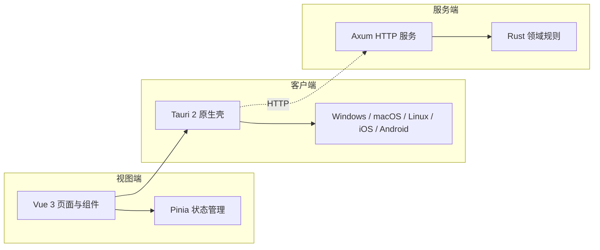

# 跨端待办应用

## 应用介绍

这是一个面向 Windows、macOS、Linux、iOS 和 Android 的跨端待办应用。用户可在不同设备上创建、查看、组织和完成待办任务，获得一致、清晰的任务管理体验。

## 产品定义

本节定义产品目标形态；各能力的当前实现进度以下方「平台能力」为准。

### 基础功能（全端一致）

| 功能       | 定义                                                                                                                                                                                                                                                                                                                                                                                                                                                                                                                                                                 |
| ---------- | -------------------------------------------------------------------------------------------------------------------------------------------------------------------------------------------------------------------------------------------------------------------------------------------------------------------------------------------------------------------------------------------------------------------------------------------------------------------------------------------------------------------------------------------------------------------- |
| 待办任务   | 任务为统一实体，周期为可选属性：不带周期即单次任务；带周期的任务按重复规则（每日 / 每周 / 每月、农历周期，及每周一三五、每月最后一天、法定工作日等高级规则，含法定节假日调休感知）在完成或到期后自动生成下一次实例。任务属性含标题、备注、截止日、提醒时刻、周期规则、标签、象限、清单；带周期的任务在列表显示周期标识与下次到期。任务另可设开始日期（未到不打扰）、起止时刻（时间段任务）、附件与链接、任务依赖、预估用时（与实际专注时长对比），支持一键复制。新建待办在同一个创建界面内一次完成全部设置（标题 / 截止日 / 提醒 / 周期规则 / 标签 / 象限 / 清单）。 |
| 定期提醒   | 到点触发系统通知；带周期的任务随重复规则持续提醒；应用未运行时由系统级后台调度兜底，不漏提醒。通知上可稍后提醒（snooze，快捷时长可自定义）；到期未完成持续重催（可设开关）；支持勿扰时段（静默暂存、结束补推）、每日晨间摘要、同一任务多级提前提醒；跨时区提醒策略（本地时刻 / 固定时刻可选）。                                                                                                                                                                                                                                                                      |
| 标签       | 用户自定义标签，为任务分类；支持按标签筛选任务与查看标签维度统计；标签可自定义颜色。                                                                                                                                                                                                                                                                                                                                                                                                                                                                                 |
| 四象限     | 重要 × 紧急二维视图（艾森豪威尔矩阵）。任务可显式指定象限；提供四象限总览用于优先级决策。                                                                                                                                                                                                                                                                                                                                                                                                                                                                            |
| 子任务     | 任务内步骤清单（checklist），逐项完成 / 取消完成，任务进度按子任务完成比例展示。                                                                                                                                                                                                                                                                                                                                                                                                                                                                                     |
| 搜索       | 按标题 / 备注全局搜索任务，桌面端快捷键直达。                                                                                                                                                                                                                                                                                                                                                                                                                                                                                                                        |
| 我的一天   | 每天从全部任务中挑选今日执行清单；作为唯一「今日」入口——晨间摘要推送它、时间块规划安排它、桌面月历表与移动卡片展示它。                                                                                                                                                                                                                                                                                                                                                                                                                                               |
| 专注计时   | 番茄钟绑定任务计时（开始 / 暂停 / 结束），专注时长计入统计；专注时可播放白噪音 / 环境音（订阅线候选）、可显示置顶迷你悬浮条；支持全屏禅模式（单任务 + 计时）。                                                                                                                                                                                                                                                                                                                                                                                                       |
| 回顾激励   | 周 / 月回顾页：完成热力图、连续完成天数（streak）、每周成就摘要；周报 / 热力图 / streak 可生成分享卡片图片；拖延洞察统计顺延次数、识别卡壳任务；里程碑成就徽章。以上收拢为单一「成就」页。                                                                                                                                                                                                                                                                                                                                                                           |
| 智能列表   | 标签 / 象限 / 清单 / 日期组合筛选保存为自定义视图，侧边栏直达。                                                                                                                                                                                                                                                                                                                                                                                                                                                                                                      |
| 日历集成   | 任务以 ICS 导出 / 订阅到系统日历（Outlook / Apple / Google）。                                                                                                                                                                                                                                                                                                                                                                                                                                                                                                       |
| 清单       | 任务归属单一清单（工作 / 生活 / 项目等），多维分类交给标签；侧边栏切换。清单可邀请成员共享协作、任务可指派（依赖账号，订阅线候选）。远期储备：多工作区（个人 / 工作数据隔离）。                                                                                                                                                                                                                                                                                                                                                                                      |
| 撤销重做   | 任务操作（完成 / 删除 / 编辑）支持撤销与重做，防误操作。                                                                                                                                                                                                                                                                                                                                                                                                                                                                                                             |
| 列表体验   | 进行中列表按 今天 / 明天 / 本周 / 以后 / 逾期 分组；支持手动拖拽排序；已完成任务定期归档、归档可查；逾期未完成任务可自动顺延到今天（可开关）。                                                                                                                                                                                                                                                                                                                                                                                                                       |
| 反馈动效   | 完成动画与可关音效，强化正向反馈。                                                                                                                                                                                                                                                                                                                                                                                                                                                                                                                                   |
| 习惯打卡   | 非独立实体：每日 / 每周周期任务以打卡形态展示（打卡 / 补卡），连续记录与热力图并入回顾激励。                                                                                                                                                                                                                                                                                                                                                                                                                                                                         |
| 时间块规划 | 今日时间轴视图，任务拖入时间块（timeboxing），联动专注计时与日历集成。                                                                                                                                                                                                                                                                                                                                                                                                                                                                                               |
| 偏好设置   | 默认提醒时间、周起始日等全局偏好可配置。                                                                                                                                                                                                                                                                                                                                                                                                                                                                                                                             |
| 开放集成   | 邮件转任务（专属转发地址）；开放 REST API 与任务变更 Webhook（订阅线）；todo:// 深链快添与定位；清单 / 任务可生成只读网页链接分享。                                                                                                                                                                                                                                                                                                                                                                                                                                  |
| 无障碍     | 应用内字号缩放、高对比模式、动效跟随系统减弱设置。                                                                                                                                                                                                                                                                                                                                                                                                                                                                                                                   |
| 登录       | 账号体系：注册 / 登录 / 登出、密码找回、修改邮箱与密码、注销账号（含云端数据抹除）。未登录可完整离线使用本机功能；登录后解锁多端同步。                                                                                                                                                                                                                                                                                                                                                                                                                               |
| 自动同步   | 登录状态下任务变更自动跨设备同步：离线变更联网后自动补推，冲突按服务端优先、字段级合并，用户无需手动操作。                                                                                                                                                                                                                                                                                                                                                                                                                                                           |
| 本地持久化 | 客户端与移动端任务数据以 SQLite 本地存储，离线优先：所有操作先落本地库，联网后经自动同步上行。                                                                                                                                                                                                                                                                                                                                                                                                                                                                       |

### AI 助手（订阅增值）

- AI 拆解子任务：大任务自动生成子任务清单，可调整后采纳；
- 智能标签象限：创建时预填标签与象限建议，确认后生效；
- AI 周报：自然语言总结本周完成情况与下周建议；
- 智能我的一天：按截止日 / 象限 / 历史习惯推荐今日清单；
- 图片 OCR 转任务：拍照 / 截图识别文字转为任务（白板、书页、聊天截图）；
- AI 自动排程：「我的一天」按估时 / 象限优先级自动排进时间块，变动自动重排；
- 智能入箱建议：无日期 / 无清单任务定期建议归档、排期或拆解（AI 周报为成就周报的订阅档，模板版免费）。

### 桌面端（Windows / macOS / Linux）

**嵌入式桌面月历表**——常驻桌面的月历组件窗口：

- 月视图日历：按日标记任务分布与完成情况，支持月份切换；
- 任务统计：当日 / 本周 / 本月的任务数与完成率；
- 任务速览：当日、本周、本月任务列表，点击任务唤起主窗口定位处理；
- 常驻形态：嵌入桌面、可置顶，随系统启动可用（现有「桌面卡片（今日待办窗口）」为其前身，直接演进为月历表形态，不再独立发展）；
- 卡片可交互：直接勾选完成、快速新增，无需唤起主窗口。

**迷你捕捉窗**——全局快捷键弹出的独立小输入窗，秒记待办后即关（内置一键贴入剪贴板文本，点击时才读取、不监听内容），不唤起主窗口、不打断当前工作。

**Windows 深度集成**（首发差异化）：

- 任务栏角标：今日剩余任务数；
- 跳转列表（Jump List）：快速新增、查看今日、唤起月历表；
- Windows 11 小组件面板接入（需评估实现可行性）；
- 视觉融合：Mica / Acrylic 材质、深色标题栏、跟随系统主题色。

**键盘全操作**——应用内快捷键体系：列表导航、快速完成 / 改期 / 打标签，不碰鼠标管理任务。

### 移动端（iOS / Android）

**常驻桌面卡片**——系统主屏小组件（iOS WidgetKit / Android AppWidget）：

- 当月统计：本月任务数与完成率；
- 任务速览：当日、本周、本月任务；
- 点击卡片或任务项直达应用内对应视图；
- 数据随应用任务变更自动刷新。

**移动交互与入口**：

- 滑动手势：列表项左右滑完成 / 删除 / 改期；
- 语音输入：系统语音识别快速记待办；
- 系统分享接入：share sheet 目标，任意应用分享文本 / 链接存为任务；
- 手表端（远期储备）：Apple Watch / Wear OS 速览与勾选；
- 锁屏 / 通知栏入口：iOS 锁屏小组件、Android 通知栏常驻快添；
- 平板适配：iPad / Android 平板分栏布局（列表 + 详情）。

### 发布基线

产品面向公开发布，**Windows 先行**（macOS / Linux 随后，移动端最后）：

- 目标用户：全场景通用——轻量用户好上手（引导与渐进披露），重度效率用户有深度（快捷键、智能列表、订阅能力）；
- 目标市场：国内 + 海外双市场同步——支付双通道（微信 / 支付宝 与 Stripe / Paddle）、ICP 备案与 GDPR 合规、服务端多区域部署；
- 商业模式：免费 + 订阅增值——本地功能永久免费；订阅权益为 多端同步、AI 助手、协作共享、开放集成（邮件转任务 / API），订阅收入承担服务器成本；订阅配套完整闭环（价格页、恢复购买、退订、发票凭证）；定价基准：轻订阅 ¥6–10/月（美元档对齐换算，AI 用量设配额）；
- 新手引导：首启引导流程、示例任务数据、空状态优化；
- 自动更新：桌面端应用内检查更新与升级；
- 质量遥测：崩溃上报与匿名使用统计（设置可关）；
- 多语言：i18n 框架，中英双语起步；
- 运营配套：应用内反馈（bug 上报附日志 + 功能建议）、What's New 新功能引导、内置帮助中心与快捷键速查；
- 分发：双渠道——Microsoft Store 上架 + 官网 / GitHub 直发（直发走应用内自动更新）；Windows 安装包与签名；Linux 阶段覆盖 deb / rpm / AppImage / Flatpak；
- 节奏：不设死线，按优先级分批交付；
- 品牌候选名：Just Do（待核商标与域名可用性后定稿；Logo 与视觉延展见 DESIGN.md 品牌遗留项）；
- 合规基线：用户协议与隐私政策应用内展示、首启同意流程；注册验证与 API 限流反滥用；
- 服务运维：服务端数据库定时备份与恢复演练、可用性与错误率监控告警；
- v1.0 范围：产品定义的全部功能均在 v1 内完成（唯二例外：手表端与多工作区为远期储备）；「Windows 先行（macOS / Linux 随后，移动端最后）」是 v1 内的实施端序，不是版本切分；同步上线初期免费公测，订阅收费随 v1 内多端就绪开启。

### 视图结构

```text
客户端（桌面）
├─ 主窗口
│  ├─ 任务        # 默认页：列表（进行中/已完成）、快速创建、编辑、标签筛选
│  └─ 视图        # 四象限 / 月历·周历 / 时间块 / 统计回顾
└─ 其他
   ├─ 桌面卡片    # 嵌入式桌面月历表（独立常驻窗口）
   └─ 登录        # 登录/注册；可跳过，离线完整可用。设置以主窗口内面板呈现

移动端
├─ 主界面（底部导航）
│  ├─ 任务        # 默认页：列表、快速创建、编辑、标签筛选
│  ├─ 视图        # 四象限 / 月历·周历 / 时间块 / 统计回顾
│  └─ 我的        # 账号与登录态、设置（主题/提醒偏好）、关于
└─ 其他
   ├─ 桌面卡片    # 系统主屏小组件（WidgetKit / AppWidget）
   └─ 登录        # 登录/注册；可跳过，离线完整可用；自「我的」进入
```

## 架构图



## 平台能力

### 能力状态总览

- [x] 基础待办管理（创建 / 完成 / 删除）
- [x] 主题：浅色 / 深色 / 跟随系统，启动恢复偏好，系统主题变化同步
- [x] 持久化：桌面端走官方 Store，浏览器开发模式回退 localStorage
- [ ] SQLite 持久化：客户端与移动端的目标本地存储，替代 Store 键值方案；同步与周期任务实例以本地库为数据底座
- [x] 诊断日志：前端统一入口，桌面端转发到官方 Log 插件
- [x] 系统托盘（桌面）：菜单含显示/隐藏、今日数量、退出；双击切换主界面
- [x] 关闭隐藏到托盘：可在设置内关闭
- [x] 截止日与提醒：`dueDate`（本地日期）/ `reminderAt`（带时区时刻）
- [x] 提醒通知：到点系统通知；首次静默请求权限，被拒绝优雅降级
- [x] 全局快捷键：`CommandOrControl+Shift+A` 唤起主界面并聚焦输入框（含从托盘唤醒）
- [x] 桌面卡片（今日待办窗口）：独立轻量窗口，按主显示器 DPI / 工作区右下角定位，始终置顶；与主窗口通过 Tauri event 双向同步
- [ ] 单实例：依赖 `tauri-plugin-single-instance`，离线缓存缺失，联网或纯 Rust 自实现后推进
- [x] 跨设备同步：客户端通过 HTTP 与 Axum 服务端操作式同步（op-based），本地变更记录为操作推送，远端变更按修订顺序字段级合并（服务端优先）
- [ ] 应用关闭期间的提醒：当前基于前端 `setTimeout`（应用运行期有效），后续叠加 Rust `NotificationBuilder::schedule` 后台调度

### 平台能力矩阵

| 能力                       | iOS / Android    | Windows / macOS / Linux | 说明                                                 |
| -------------------------- | ---------------- | ----------------------- | ---------------------------------------------------- |
| 基础待办管理               | ✅               | ✅                      | 创建 / 完成 / 删除                                   |
| 主题（浅 / 深 / 跟随系统） | ✅               | ✅                      | 启动恢复；系统主题变化同步                           |
| 持久化                     | ✅（浏览器回退） | ✅                      | 官方 Store；浏览器回退 localStorage；目标迁移 SQLite |
| 诊断日志                   | ✅（控制台）     | ✅                      | 桌面端转发官方 Log 插件                              |
| 系统托盘                   | —                | ✅                      | 菜单 + 双击切换                                      |
| 关闭隐藏到托盘             | —                | ✅                      | 可在设置内关闭                                       |
| 截止日                     | ✅               | ✅                      | 列表徽标（今天 / 明天 / 逾期）                       |
| 提醒通知                   | —                | ✅                      | 桌面端系统通知；权限静默请求；应用运行期调度         |
| 全局快捷键                 | —                | ✅                      | `CommandOrControl+Shift+A`                           |
| 桌面卡片                   | —                | ✅                      | 独立轻量窗口；DPI 感知定位；event 双向同步           |
| 跨设备同步                 | —                | ✅                      | 操作式同步；服务端优先；字段级合并                   |
| 单实例                     | —                | ⏳                      | 依赖未就绪                                           |
