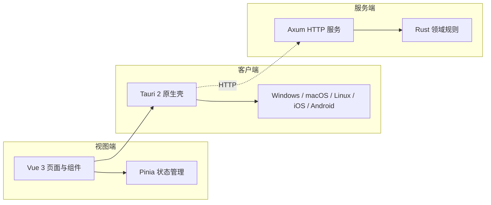

# 跨端待办应用

## 应用介绍

这是一个面向 Windows、macOS、Linux、iOS 和 Android 的跨端待办应用。用户可在不同设备上创建、查看、组织和完成待办任务，获得一致、清晰的任务管理体验。

## 产品定义

本节定义产品目标形态；各能力的当前实现进度以下方「平台能力」为准。

### 基础功能（全端一致）

| 功能 | 定义 |
| --- | --- |
| 待办任务 | 单次任务与周期任务。周期任务按重复规则（每日 / 每周 / 每月等）在完成或到期后自动生成下一次实例；任务属性含标题、截止日、提醒时刻、标签、象限。 |
| 定期提醒 | 到点触发系统通知；周期任务随重复规则持续提醒；应用未运行时由系统级后台调度兜底，不漏提醒。 |
| 标签 | 用户自定义标签，为任务分类；支持按标签筛选任务与查看标签维度统计。 |
| 四象限 | 重要 × 紧急二维视图（艾森豪威尔矩阵）。任务可显式指定象限；提供四象限总览用于优先级决策。 |
| 登录 | 账号体系（注册 / 登录 / 登出）。未登录可完整离线使用本机功能；登录后解锁多端同步。 |
| 自动同步 | 登录状态下任务变更自动跨设备同步：离线变更联网后自动补推，冲突按服务端优先、字段级合并，用户无需手动操作。 |
| 本地持久化 | 客户端与移动端任务数据以 SQLite 本地存储，离线优先：所有操作先落本地库，联网后经自动同步上行。 |

### 桌面端（Windows / macOS / Linux）

**嵌入式桌面月历表**——常驻桌面的月历组件窗口：

- 月视图日历：按日标记任务分布与完成情况，支持月份切换；
- 任务统计：当日 / 本周 / 本月的任务数与完成率；
- 任务速览：当日、本周、本月任务列表，点击任务唤起主窗口定位处理；
- 常驻形态：嵌入桌面、可置顶，随系统启动可用（现有「桌面卡片（今日待办窗口）」为其前身，将演进为月历表形态）。

### 移动端（iOS / Android）

**常驻桌面卡片**——系统主屏小组件（iOS WidgetKit / Android AppWidget）：

- 当月统计：本月任务数与完成率；
- 任务速览：当日、本周、本月任务；
- 点击卡片或任务项直达应用内对应视图；
- 数据随应用任务变更自动刷新。

### 视图结构

```text
客户端（桌面）
├─ 主窗口
│  ├─ 任务        # 默认页：列表（进行中/已完成）、快速创建、编辑、标签筛选
│  └─ 视图        # 四象限 / 月历 / 统计回顾
└─ 其他
   ├─ 桌面卡片    # 嵌入式桌面月历表（独立常驻窗口）
   └─ 登录        # 登录/注册；可跳过，离线完整可用。设置以主窗口内面板呈现

移动端
├─ 主界面（底部导航）
│  ├─ 任务        # 默认页：列表、快速创建、编辑、标签筛选
│  ├─ 视图        # 四象限 / 月历 / 统计回顾
│  └─ 我的        # 账号与登录态、设置（主题/提醒偏好）、关于
└─ 其他
   ├─ 桌面卡片    # 系统主屏小组件（WidgetKit / AppWidget）
   └─ 登录        # 登录/注册；可跳过，离线完整可用；自「我的」进入
```

## 架构图



## 平台能力

### 能力状态总览

- [x] 基础待办管理（创建 / 完成 / 删除）
- [x] 主题：浅色 / 深色 / 跟随系统，启动恢复偏好，系统主题变化同步
- [x] 持久化：桌面端走官方 Store，浏览器开发模式回退 localStorage
- [ ] SQLite 持久化：客户端与移动端的目标本地存储，替代 Store 键值方案；同步与周期任务实例以本地库为数据底座
- [x] 诊断日志：前端统一入口，桌面端转发到官方 Log 插件
- [x] 系统托盘（桌面）：菜单含显示/隐藏、今日数量、退出；双击切换主界面
- [x] 关闭隐藏到托盘：可在设置内关闭
- [x] 截止日与提醒：`dueDate`（本地日期）/ `reminderAt`（带时区时刻）
- [x] 提醒通知：到点系统通知；首次静默请求权限，被拒绝优雅降级
- [x] 全局快捷键：`CommandOrControl+Shift+A` 唤起主界面并聚焦输入框（含从托盘唤醒）
- [x] 桌面卡片（今日待办窗口）：独立轻量窗口，按主显示器 DPI / 工作区右下角定位，始终置顶；与主窗口通过 Tauri event 双向同步
- [ ] 单实例：依赖 `tauri-plugin-single-instance`，离线缓存缺失，联网或纯 Rust 自实现后推进
- [x] 跨设备同步：客户端通过 HTTP 与 Axum 服务端操作式同步（op-based），本地变更记录为操作推送，远端变更按修订顺序字段级合并（服务端优先）
- [ ] 应用关闭期间的提醒：当前基于前端 `setTimeout`（应用运行期有效），后续叠加 Rust `NotificationBuilder::schedule` 后台调度

### 平台能力矩阵

| 能力                       | iOS / Android    | Windows / macOS / Linux | 说明                                         |
| -------------------------- | ---------------- | ----------------------- | -------------------------------------------- |
| 基础待办管理               | ✅               | ✅                      | 创建 / 完成 / 删除                           |
| 主题（浅 / 深 / 跟随系统） | ✅               | ✅                      | 启动恢复；系统主题变化同步                   |
| 持久化                     | ✅（浏览器回退） | ✅                      | 官方 Store；浏览器回退 localStorage；目标迁移 SQLite |
| 诊断日志                   | ✅（控制台）     | ✅                      | 桌面端转发官方 Log 插件                      |
| 系统托盘                   | —                | ✅                      | 菜单 + 双击切换                              |
| 关闭隐藏到托盘             | —                | ✅                      | 可在设置内关闭                               |
| 截止日                     | ✅               | ✅                      | 列表徽标（今天 / 明天 / 逾期）               |
| 提醒通知                   | —                | ✅                      | 桌面端系统通知；权限静默请求；应用运行期调度 |
| 全局快捷键                 | —                | ✅                      | `CommandOrControl+Shift+A`                   |
| 桌面卡片                   | —                | ✅                      | 独立轻量窗口；DPI 感知定位；event 双向同步   |
| 跨设备同步                 | —                | ✅                      | 操作式同步；服务端优先；字段级合并           |
| 单实例                     | —                | ⏳                      | 依赖未就绪                                   |

