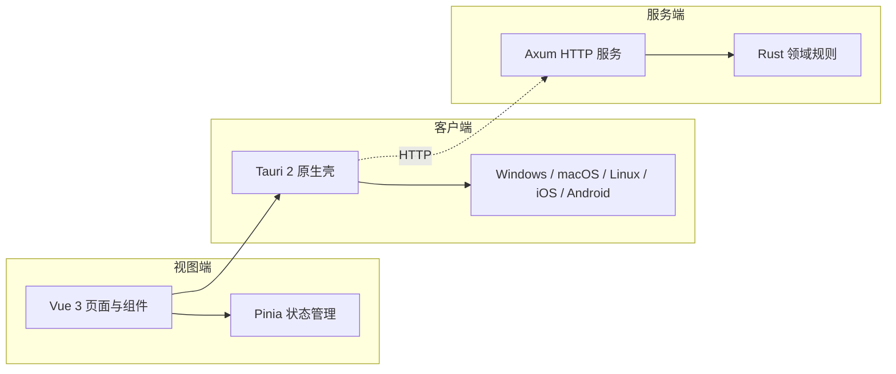

# 跨端待办应用

## 应用介绍

这是一个面向 Windows、macOS、Linux、iOS 和 Android 的跨端待办应用。用户可在不同设备上创建、查看、组织和完成待办任务，获得一致、清晰的任务管理体验。

当前版本聚焦基础待办管理；持久化、同步、账号和提醒暂不在本阶段范围内。

## 架构图

## 平台能力

| 平台    | 当前能力                                   |
| ------- | ------------------------------------------ |
| iOS     | 使用待办管理：创建、查看、组织和完成任务。 |
| Android | 使用待办管理：创建、查看、组织和完成任务。 |
| Windows | 使用待办管理：创建、查看、组织和完成任务。 |
| macOS   | 使用待办管理：创建、查看、组织和完成任务。 |
| Linux   | 使用待办管理：创建、查看、组织和完成任务。 |
